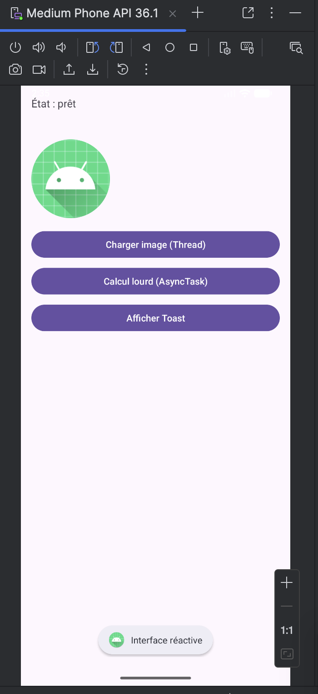
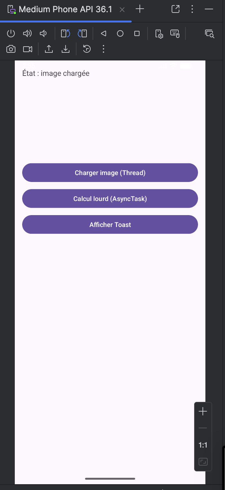
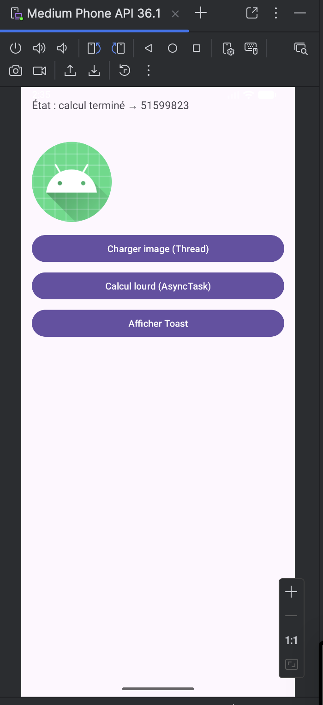

# LAB 5 – Threads et AsyncTask sur Android

## Aperçu du projet

Ce laboratoire a pour objectif de comprendre la gestion des threads en Android et l'utilisation d'AsyncTask pour effectuer des traitements longs sans bloquer l'interface utilisateur. L'application démontre deux cas d'utilisation : le chargement d'une image dans un thread séparé et un calcul lourd avec AsyncTask, tout en maintenant l'UI réactive.

---

## Concepts fondamentaux

### 1. UI Thread (Main Thread)
- Affiche l'écran (boutons, textes, images)
- Gère les clics utilisateur
- Exécute `onCreate()`
- **Règle** : Un traitement long dans l'UI Thread fige l'application (risque d'ANR)

### 2. Worker Thread (Thread de fond)
- Effectue les calculs lourds
- Gère les accès réseau
- Charge des données en arrière-plan
- **Contrainte** : Ne peut pas modifier directement une View

### 3. Solutions pour revenir à l'UI Thread
- `view.post(runnable)`
- `Handler(Looper.getMainLooper()).post(runnable)`
- `runOnUiThread(runnable)`

### 4. AsyncTask
Exécute `doInBackground()` dans un thread de fond et revient automatiquement sur l'UI thread dans :
- `onPreExecute()` (avant)
- `onProgressUpdate()` (pendant)
- `onPostExecute()` (après)

---

## Architecture du projet

```
LabThreadsAsyncTask/
├── app/
│   ├── src/
│   │   ├── main/
│   │   │   ├── java/com/example/labthreadsasynctask/
│   │   │   │   └── MainActivity.java
│   │   │   └── res/
│   │   │       └── layout/
│   │   │           └── activity_main.xml
│   │   └── AndroidManifest.xml
```

---

## Étape 1 – Création de l'interface (XML)



**Composants de l'interface :**
- `statusText` : TextView affichant l'état courant
- `progressBar` : ProgressBar horizontale (invisible par défaut)
- `imageView` : ImageView avec l'icône par défaut
- `loadImageBtn` : Bouton "Charger image (Thread)"
- `heavyCalcBtn` : Bouton "Calcul lourd (AsyncTask)"
- `showToastBtn` : Bouton "Afficher Toast"

---

## Étape 2 – Test de la réactivité de l'UI


**Action :** Clic sur "Afficher Toast"
- Le toast "Interface réactive" s'affiche immédiatement
- Confirme que l'application répond correctement

---

## Étape 3 – Chargement d'image avec Thread

### Code implémenté
```java
private void startImageLoading() {
    progressBar.setVisibility(View.VISIBLE);
    progressBar.setProgress(0);
    statusText.setText("État : téléchargement image...");

    new Thread(() -> {
        try {
            Thread.sleep(1000);
        } catch (InterruptedException e) {
            e.printStackTrace();
        }

        Bitmap imageBitmap = BitmapFactory.decodeResource(getResources(), R.mipmap.ic_launcher);

        uiHandler.post(() -> {
            imageView.setImageBitmap(imageBitmap);
            progressBar.setVisibility(View.INVISIBLE);
            statusText.setText("État : image chargée");
        });
    }).start();
}
```

### Résultat après clic sur "Charger image (Thread)"



**Validation :**
- La ProgressBar apparaît pendant 1 seconde
- L'icône reste visible (utilisation de l'icône par défaut)
- Le message "État : image chargée" confirme la fin du traitement
- L'UI reste réactive pendant le chargement

---

## Étape 4 – Calcul lourd avec AsyncTask

### Code implémenté
```java
private class ComplexCalculation extends AsyncTask<Void, Integer, Long> {

    @Override
    protected void onPreExecute() {
        progressBar.setVisibility(View.VISIBLE);
        progressBar.setProgress(0);
        statusText.setText("État : calcul en cours...");
    }

    @Override
    protected Long doInBackground(Void... params) {
        long total = 0;

        for (int step = 1; step <= 100; step++) {
            for (int count = 0; count < 200000; count++) {
                total += (step * count) % 7;
            }
            publishProgress(step);
        }
        return total;
    }

    @Override
    protected void onProgressUpdate(Integer... values) {
        progressBar.setProgress(values[0]);
    }

    @Override
    protected void onPostExecute(Long result) {
        progressBar.setVisibility(View.INVISIBLE);
        statusText.setText("État : calcul terminé → " + result);
    }
}
```

### Résultat après clic sur "Calcul lourd (AsyncTask)"



**Validation :**
- La ProgressBar se remplit progressivement de 0 à 100%
- Le résultat du calcul s'affiche : **51599823**
- L'interface reste réactive pendant tout le calcul

---

## Étape 5 – Test complet de l'application

### États successifs de l'application

| État initial | Image chargée | Calcul terminé |
|:------------:|:-------------:|:--------------:|
|  |  |  |

### Vérifications effectuées

1. **Clic sur "Afficher Toast"** ✅ Toast affiché immédiatement
2. **Clic sur "Charger image (Thread)"** ✅ ProgressBar visible puis image conservée
3. **Pendant le chargement** ✅ Toast toujours réactif (UI non bloquée)
4. **Clic sur "Calcul lourd (AsyncTask)"** ✅ ProgressBar de 0 à 100%
5. **Affichage du résultat** ✅ Calcul correct : 51599823

---

## Points techniques abordés

- **Thread** : Création et démarrage d'un thread avec `new Thread().start()`
- **Handler** : Retour à l'UI thread avec `mainHandler.post()`
- **AsyncTask** : Les 4 méthodes clés (`onPreExecute`, `doInBackground`, `onProgressUpdate`, `onPostExecute`)
- **ProgressBar** : Affichage et mise à jour de la progression
- **Toast** : Vérification de la réactivité de l'UI
- **Bitmap** : Chargement d'une image depuis les ressources

---

## Conclusion

Ce laboratoire a permis de comprendre :
- L'importance de ne pas bloquer l'UI Thread
- L'utilisation des Threads pour les opérations longues
- L'utilisation d'AsyncTask comme solution pédagogique
- La communication entre threads de fond et UI thread
- La mise à jour progressive d'une ProgressBar

L'application démontre avec succès les deux approches tout en maintenant une interface réactive, validée par l'affichage des toasts pendant les traitements.
